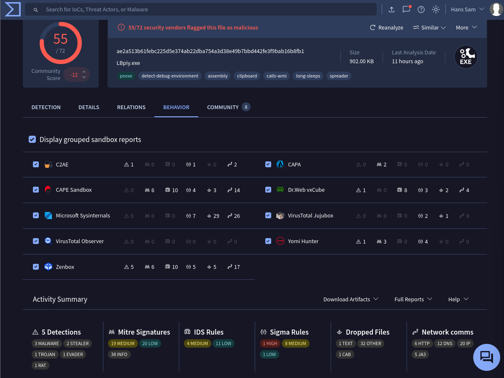
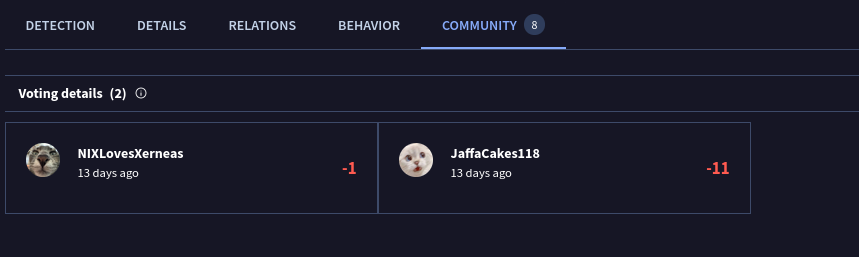
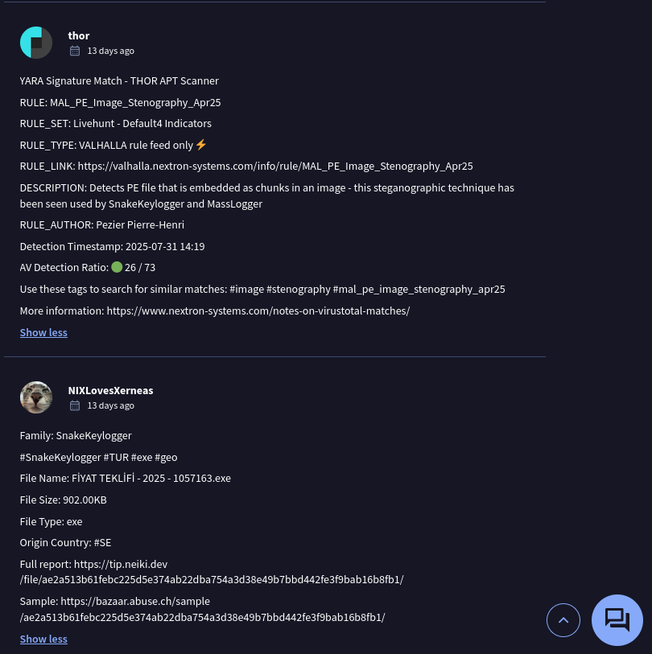
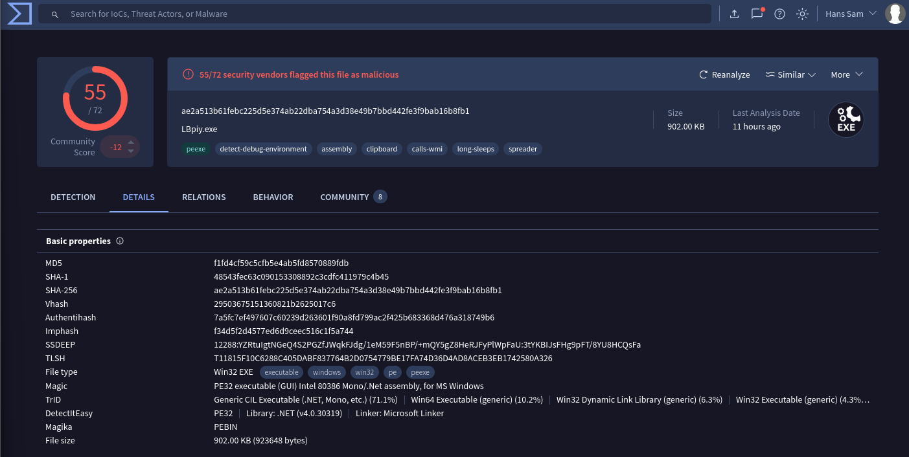

# VirusTotal Analysis Report

## 📁 File Info
- Filename: malware_sample.zip
- File inside: 
    - ae2a513b61febc225d5e374ab22dba754a3d38e49b7bbd442fe3f9bab16b8fb1.exe
- Hashes:
  - MD5: f1fd4cf59c5cfb5e4ab5fd8570889fdb
  - SHA1:48543fec63c090153308892c3cdfc411979c4b45
  - SHA256: 
ae2a513b61febc225d5e374ab22dba754a3d38e49b7bbd442fe3f9bab16b8fb1 

## 🧪 Detection
| Engine | Detection |
|--------|-----------|
| AhnLab-V3 | 🟥 Malware/Win.Kryptik.C5784104 |
| Alibaba | 🟥 Trojan:MSIL/Taskun.cf3a01e2 |
| AliCloud | 🟥 Trojan:MSIL/Egairtigado.Gen |
| ALYac | 🟥 Trojan.GenericKDZ.112786 |
| Arcabit | 🟥 Trojan.Generic.D1B892 |
| Arctic Wolf | 🟥 Unsafe |
| Avast | 🟥 Win32:MalwareX-gen [Pws] |
| AVG | 🟥 Win32:MalwareX-gen [Pws] |
| Avira (no cloud) | 🟥 TR/AD.SnakeStealer.lzrbr |
| BitDefender | 🟥 Trojan.GenericKDZ.112786 |
| CrowdStrike Falcon | 🟥 Win/malicious_confidence_100% (D) |
| CTX | 🟥 Exe.trojan.msil |
| DeepInstinct | 🟥 MALICIOUS |
| DrWeb | 🟥 Trojan.Packed2.49940 |
| Elastic | 🟥 Malicious (high Confidence) |
| Emsisoft | 🟥 Trojan.GenericKDZ.112786 (B) |
| eScan | 🟥 Trojan.GenericKDZ.112786 |
| ESET-NOD32 | 🟥 A Variant Of MSIL/Kryptik.AOBM |
| Fortinet | 🟥 MSIL/Formbook.HDZY!tr |
| GData | 🟥 Trojan.GenericKDZ.112786 |
| Google | 🟥 Detected |
| Gridinsoft (no cloud) | 🟥 Trojan.Win32.Wacatac.sa |
| Huorong | 🟥 TrojanSpy/MSIL.Stealer.js |
| Ikarus | 🟥 Trojan.MSIL.Inject |
| K7AntiVirus | 🟥 Trojan (005cb4e21) |
| K7GW | 🟥 Trojan (005cb4e21) |
| Kaspersky | 🟥 HEUR:Trojan.MSIL.Taskun.gen |
| Kingsoft | 🟥 MSIL.Trojan.Taskun.gen |
| Lionic | 🟥 Trojan.Win32.Taskun.4!c |
| Malwarebytes | 🟥 Trojan.MalPack.PNG.Generic |
| MaxSecure | 🟥 Trojan.Malware.407633379.susgen |
| McAfee Scanner | 🟥 Ti!AE2A513B61FE |
| Microsoft | 🟥 Trojan:Win32/Egairtigado!rfn |
| Palo Alto Networks | 🟥 Generic.ml |
| Panda | 🟥 Trj/Chgt.AD |
| QuickHeal | 🟥 Trojan.MSIL |
| Rising | 🟥 Malware.Obfus/MSIL@AI.100 |
| Sangfor Engine Zero | 🟥 Infostealer.Msil.Taskun.Vq2n |
| SecureAge | 🟥 Malicious |
| Skyhigh (SWG) | 🟥 BehavesLike.Win32.Generic.dc |
| Sophos | 🟥 Troj/Krypt-AQM |
| Symantec | 🟥 Scr.Malcode!gdn34 |
| Tencent | 🟥 Malware.Win32.Gencirc.1499b3e7 |
| Trapmine | 🟥 Malicious.high.ml.score |
| Trellix ENS | 🟥 PWS-FEAO!F1FD4CF59C5C |
| TrendMicro | 🟥 TrojanSpy.Win32.NEGASTEAL.YXFG5Z |
| TrendMicro-HouseCall | 🟥 TrojanSpy.Win32.NEGASTEAL.YXFG5Z |
| Varist | 🟥 W32/MSIL_Kryptik.MNI.gen!Eldorado |
| VIPRE | 🟥 Trojan.GenericKDZ.112786 |
| VirIT | 🟥 Trojan.Win32.GenusT.FBKH |
| Webroot | 🟥 Win.Trojan.Gen |
| WithSecure | 🟥 Trojan.TR/AD.SnakeStealer.lzrbr |
| Yandex | 🟥 Trojan.Igent.b4RFmo.2 |
| Zillya | 🟥 Trojan.Kryptik.Win32.5445530 |
| ZoneAlarm by Check Point | 🟥 Troj/Krypt-AQM |

## 📡 Network Indicators
### Contacted Domains
- `_kerberos._tcp.dc._msdcs.gaziotomasyon.com.tr`
- `api.msn.com`
- `api.telegram.org`
- `checkip.dyndns.com`
- `checkip.dyndns.org`
- `config-edge-skype.ln-0007.ln-msedge.net`
- `dyndns.org`
- `ln-0007.ln-msedge.net`
- `reallyfreegeoip.org`
- `res.public.onecdn.static.microsoft`

### Contacted IPs
- `104.21.112.1`
- `104.21.16.1`
- `104.21.32.1`
- `104.21.48.1`
- `104.21.64.1`
- `104.21.80.1`
- `104.21.96.1`
- `132.226.247.73`
- `132.226.8.169`
- `149.154.167.220`

## 📊 Behavioral Summary

## 🗣️ Community Insight

## 🔐 Public Link
- [VirusTotal Public Scan Link](https://www.virustotal.com/gui/file/ae2a513b61febc225d5e374ab22dba754a3d38e49b7bbd442fe3f9bab16b8fb1)

## 🖼️ Screenshots

